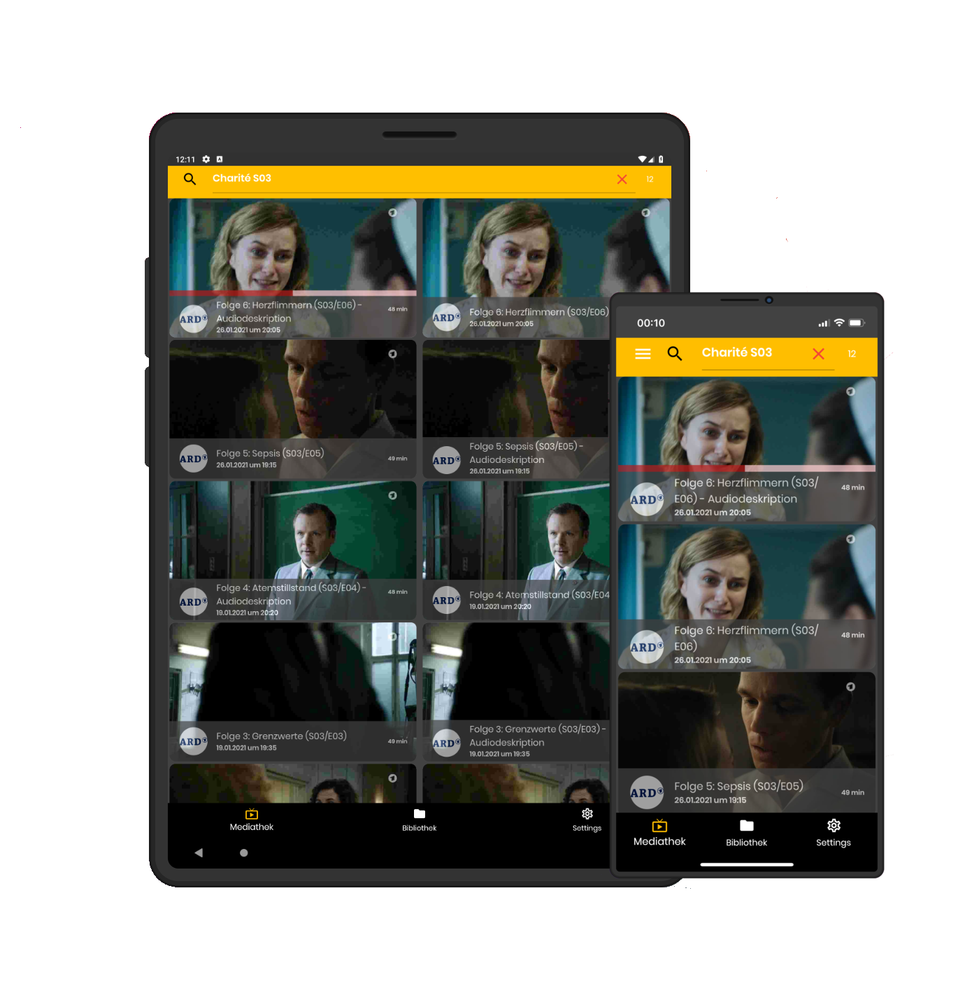

MediathekViewMobile is an Android and iOS application written with Flutter that allows searching through and downloading videos from
a wide range of public German TV providers (ARD, ZDF, Arte, 3Sat, SWR, BR, MDR, NDR, WDR, HR, RBB, ORF, SRF).
It uses the API of [MediathekViewWeb](https://mediathekviewweb.de/).

[Hier gibts die READ.ME in deutscher Sprache]().



# Highlights

- Quick and comfortable search (including filters) over all videos from supported German public TV channels.
- Download Videos for offline viewing.
- Videoplayer that remembers last viewing positions
- Stream videos to supported TVs (currently Samsung) and use your device for remote control.
- View History

# Installation
 
**Android**
 - FDroid (coming soon)
 - [Github Releases](https://github.com/mediathekview/MediathekViewMobile/releases/)  
 
**iOS**
  - See the [iOS installation instructions](docs/install-ios.md)

## Installation from Source for Android

First [install Flutter](https://flutter.dev/docs/get-started/install).
Then, clone this repository.

```
git clone https://github.com/mediathekview/MediathekViewMobile
```

Connect your Android or iOS device to your computer.
Make sure that your device is detected via
```
flutter doctor
```

Then install MediathekViewMobile by executing `flutter run --release` from the repository root.

## Installation from Source for iOS

In addition to the steps for iOS, you need to setup XCode and configure the project to use your Apple ID.
Please check the [Flutter iOS platform setup Guide](https://flutter.dev/docs/get-started/install/macos#platform-setup).

To install MediathekViewMobile, make sure you have [setup XCode properly](https://flutter.dev/docs/get-started/install/macos#platform-setup).
You can install the application via XCode or by executing `flutter run --release` from the repository root.
 
[](https://paypal.me/danielfoehr)
